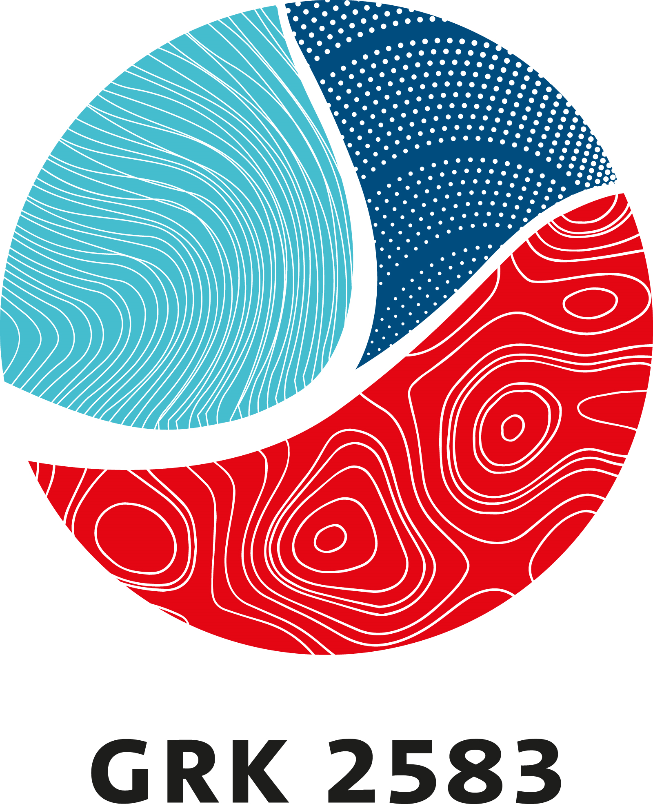

# Bathymetry Reconstruction in a Water Channel

## Description
This code reconstructs the bathymetry in a water channel using either simulated or experimental observation data. We use gradient descent to minimise an objective functional, where we compute the numerical solution of the continuous adjoint problem in order to determine the gradient. The forward problem is modelled by the nonlinear nonrotating shallow water equations and discretised with the spectral methods framework [Dedalus](https://dedalus-project.org/).

## How to reproduce the data and plots
### Solutions of the SWE
- Go to the file `ProblemRelatedFiles/Compute_channel_forward.py`.
- Set variables as needed. In particular, set `save = True`.
- Execute the file.
### Plots of the solution of the SWE
- Go to the file `create_plots_forward.py`.
- Insert the file name that was generated by `ProblemRelatedFiles/Compute_channel_forward.py`.
- Set `save = True`.
- Execute the file.
### Optimisation results
We provide the hdf5 files with optimisation data here (Link still to be added). If you want to compute those yourself, use the file gradient_descent.py as follows.
- Set `save = True`.
- In `ProblemRelatedFiles/params.py` change the indicated variables as needed.
- Execute the file `gradient_descent.py`.
### Plots of the bathymetry reconstruction etc.
- Go to the file `create_plots.py`.
- Insert the folder name that was generated by the file `gradient_descent.py` (e.g. 2024_02_22_09_12_AM).
- Set `save = True`.
- Execute the file.
### Plot of the bathymetry
- Execute the file `plot_bathymetry.py`.
- Optional: Uncomment the code lines at the bottom to save the figure.

## Requirements
Installation of [Dedalus](https://dedalus-project.readthedocs.io/en/latest/pages/installation.html) version 3.0.0 or newer is required. For the versions of NumPy, SciPy etc. see the file `requirements.txt`.

## Acknowledgements
This project has received funding from the European High-Performance Computing Joint Undertaking (JU) under grant agreement No 955701 (Time-X). The JU receives support from the European Union’s Horizon 2020 research and innovation programme and Belgium, France, Germany, and Switzerland. This project also received funding from the German Federal Ministry of Education and Research (BMBF) grant 16HPC048.
The authors acknowledge the support by the Deutsche Forschungsgemeinschaft (DFG) within the Research Training Group GRK 2583 ``Modeling, Simulation and Optimization of Fluid Dynamic Applications''.

   &nbsp;&nbsp;&nbsp;&nbsp;&nbsp;&nbsp;&nbsp;&nbsp;
   &nbsp;&nbsp;&nbsp;&nbsp;&nbsp;&nbsp;&nbsp;&nbsp;
  

   &nbsp;&nbsp;&nbsp;&nbsp;&nbsp;&nbsp;&nbsp;&nbsp;
   &nbsp;&nbsp;&nbsp;&nbsp;&nbsp;&nbsp;&nbsp;&nbsp;
  

